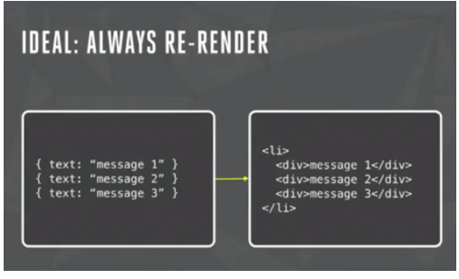

# react-data-flow 的前世今生

## react 是什么？

(1) react出发点

用于开发数据不断变化的大型应用程序:Building large applications with data that changes over time

(2) react的面临的问题域

  * 问题描述

    聊天应用的例子，当一条新的消息过来时,我们应该怎么办？

  * 传统的web开发范式

    
  * react的解答方式

    
  * react的系统职责

    当数据(state)发生变化后，如何高效的渲染出该组件

(3) react的解决方案

  * 一旦状态发生了变化，就用模版引擎重新渲染整个视图，然后用新的视图更换掉旧的视图

  * Virtual DOM算法

   * 用 JavaScript 对象表示 DOM 信息和结构，当状态变更的时候，重新渲染这个 JavaScript 的对象结构

   * 用新渲染的对象树去和旧的树进行对比，记录这两棵树差异

   * 记录下来的不同就是我们需要对页面真正的 DOM 操作，然后把它们应用在真正的 DOM 树上，页面就变更了

  * 具体算法细节

   * define virtual dom --- (Element class)

   

   

   * 比较两颗dom树的差异

     * 一般情况下，diff 两颗树的时间复杂度是 o(n^3)的，但是 react 依据”但是在前端当中，你很少会跨越层级地移动DOM元素“这个尝试，只比较同层的元素，时间复杂度降低为 o(n)
     * 定义了两个节点可能的差异类型：
        * 替换掉原来的节点，例如把上面的div换成了section
        * 移动、删除、新增子节点，例如上面div的子节点，把p和ul顺序互换 (最小编辑距离，动态规划)
        * 修改了节点的属性
        * 对于文本节点，文本内容可能会改变。例如修改上面的文本节点2内容为Virtual DOM 2

   * 应用差异数组(patches=[{type:'',node: ''}])
 (4) 结论
   * react是一个 view = f(state)
   * 专注于：利用vd让state的变化快速反应到view

## data-flow 是什么？

 (1) 概要
   * react以组件为页面信息架构的基本单元，然而组件之间并非是孤立的，相反是联动的，互相协作才能完成前端展示和交互逻辑，因此，我们通过data-flow这种方式，完成组件间的协作。

(2) react原生支持的方式
   * this.props, <child prop1={props} />父节点给子节点显示的传递，这种方式是大家最常见的方式，简单明了，然而，弊端也是十分明显的，当两个组件之间的关系比较复杂，存在跨层或者越过父节点的情况下，过于复杂，感官上影响正常的代码.
   * React.withContext 和 getChildContext, 优点是可以显著减少props的上下传递
   * 总之: react 提供的数据流动api过于底层，在成产环境下，需要过多的代码量，因此，需要一个比较统一的解决方案

 (3) demo 描述

   

## flux

## reflux
## react-data-binding
## redux
## 写在最后
## 参考文献
    - [颠覆式前端UI开发框架：React] (http://www.infoq.com/cn/articles/subversion-front-end-ui-development-framework-react)
    - [深度剖析：如何实现一个 Virtual DOM 算法] (https://github.com/livoras/blog/issues/13)
